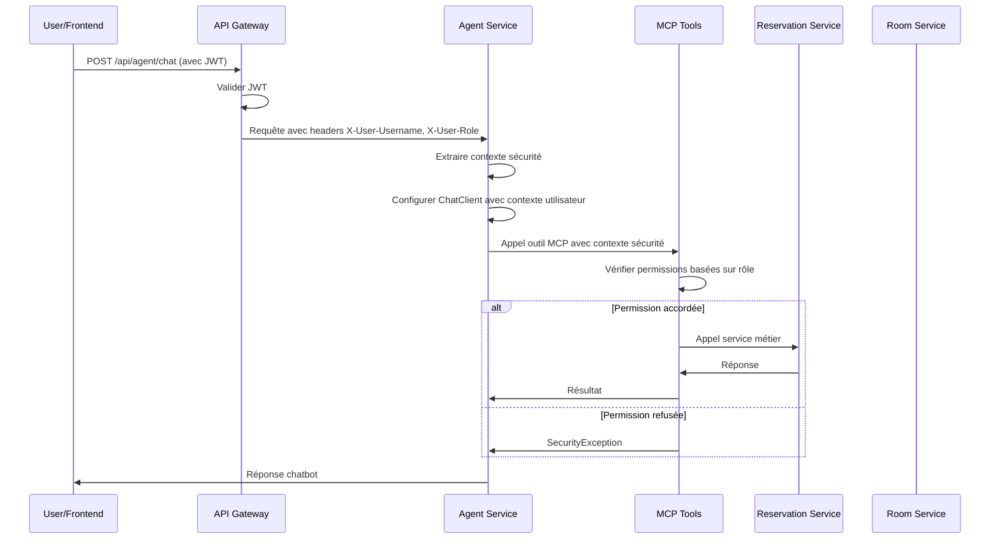

# Design Document - Chatbot Security Fix

## Overview

Ce document décrit la conception technique pour sécuriser le système de chatbot ResaBot et les endpoints MCP. La solution implémente un contrôle d'accès basé sur les rôles (RBAC) cohérent avec l'architecture de sécurité existante, en s'appuyant sur la validation JWT et les mécanismes d'autorisation déjà en place.

L'approche privilégie la réutilisation des composants de sécurité existants tout en ajoutant les contrôles spécifiques nécessaires pour les interactions chatbot et les outils MCP.

## Architecture

### Vue d'ensemble du flux de sécurité



### Composants modifiés

1. **Agent Service Controller** : Ajout de validation de sécurité
2. **MCP Tools** : Intégration des contrôles d'accès basés sur les rôles
3. **Security Configuration** : Mise à jour pour protéger les endpoints MCP
4. **ChatClient Configuration** : Injection du contexte de sécurité

## Components and Interfaces

### 1. SecurityContext pour MCP

```java
public class McpSecurityContext {
    private final String username;
    private final String role;
    private final boolean isAdmin;

    public McpSecurityContext(String username, String role) {
        this.username = username;
        this.role = role;
        this.isAdmin = "ADMIN".equals(role);
    }

    public void requireAdmin() throws SecurityException {
        if (!isAdmin) {
            throw new SecurityException("Action requires ADMIN role");
        }
    }

    public void requireUserOrAdmin() throws SecurityException {
        if (!"USER".equals(role) && !"ADMIN".equals(role)) {
            throw new SecurityException("Action requires USER or ADMIN role");
        }
    }

    public boolean canAccessUserData(String targetUsername) {
        return isAdmin || username.equals(targetUsername);
    }
}
```

### 2. Agent Controller sécurisé

```java
@RestController
@RequestMapping("/api/agent")
@RequiredArgsConstructor
public class SecureAgentController {

    @PostMapping("/chat")
    @PreAuthorize("hasAnyAuthority('USER', 'ADMIN')")
    public Flux<String> chat(@RequestBody ChatRequest request, Authentication auth) {
        String username = auth.getName();
        String role = extractRole(auth);

        // Créer contexte de sécurité
        McpSecurityContext securityContext = new McpSecurityContext(username, role);

        // Configurer ChatClient avec contexte sécurisé
        ChatClient securedChatClient = createSecuredChatClient(securityContext);

        return securedChatClient
                .prompt()
                .user(buildSecurePrompt(request, securityContext))
                .stream()
                .content();
    }
}
```

### 3. MCP Tools sécurisés

```java
@Component
@RequiredArgsConstructor
public class SecureReservationMcpTools {

    @McpTool(name = "createReservation")
    public ReservationDTO createReservation(
            @McpToolParam String username,
            @McpToolParam Long roomId,
            @McpToolParam String date,
            @McpToolParam String startTime,
            @McpToolParam String endTime,
            McpSecurityContext securityContext) {

        securityContext.requireUserOrAdmin();

        // USER peut seulement créer pour lui-même
        if (!securityContext.canAccessUserData(username)) {
            throw new SecurityException("Cannot create reservation for another user");
        }

        return reservationService.createReservation(request);
    }

    @McpTool(name = "listAllReservations")
    public List<ReservationDTO> listAllReservations(McpSecurityContext securityContext) {
        securityContext.requireAdmin(); // Seuls les ADMIN peuvent voir toutes les réservations
        return reservationService.getAllReservations();
    }

    @McpTool(name = "getUserReservations")
    public List<ReservationDTO> getUserReservations(
            @McpToolParam String username,
            McpSecurityContext securityContext) {

        securityContext.requireUserOrAdmin();

        if (!securityContext.canAccessUserData(username)) {
            throw new SecurityException("Cannot access another user's reservations");
        }

        return reservationService.getReservationsByUsername(username);
    }
}
```

### 4. Configuration de sécurité mise à jour

```java
@Configuration
@EnableWebSecurity
@EnableMethodSecurity
public class UpdatedHeaderSecurityConfig {

    @Bean
    public SecurityFilterChain securityFilterChain(HttpSecurity http) throws Exception {
        return http
                .csrf(AbstractHttpConfigurer::disable)
                .authorizeHttpRequests(auth -> auth
                        .requestMatchers("/mcp/**").authenticated() // ✅ Protéger les endpoints MCP
                        .anyRequest().permitAll()
                )
                .addFilterBefore(new HeaderAuthenticationFilter(), UsernamePasswordAuthenticationFilter.class)
                .build();
    }
}
```

## Data Models

### McpSecurityContext

- `username: String` - Nom d'utilisateur authentifié
- `role: String` - Rôle de l'utilisateur (USER/ADMIN)
- `isAdmin: boolean` - Flag calculé pour vérifications rapides

### SecureChatRequest

- `message: String` - Message utilisateur
- `username: String` - Nom d'utilisateur (extrait du JWT)
- `role: String` - Rôle utilisateur (extrait du JWT)

### SecurityAuditLog

- `timestamp: LocalDateTime` - Horodatage de l'action
- `username: String` - Utilisateur ayant effectué l'action
- `action: String` - Action tentée
- `resource: String` - Ressource ciblée
- `success: boolean` - Succès ou échec
- `errorMessage: String` - Message d'erreur si applicable

## Correctness Properties

_A property is a characteristic or behavior that should hold true across all valid executions of a system-essentially, a formal statement about what the system should do. Properties serve as the bridge between human-readable specifications and machine-verifiable correctness guarantees._

### Property Reflection

After analyzing all acceptance criteria, several properties can be consolidated to eliminate redundancy:

- Properties 1.4 and 3.1-3.5 can be combined into a comprehensive "Admin Full Access" property
- Properties 2.1, 2.3, and ownership validation can be combined into a "User Ownership" property
- Properties 4.4 and 4.5 can be combined into a "HTTP Error Response" property
- Properties 5.1-5.4 can be combined into a "User-Friendly Error Messages" property
- Properties 6.1-6.4 can be combined into a "Comprehensive Audit Logging" property

### Core Properties

**Property 1: JWT Authentication Required**
_For any_ MCP endpoint request, the system should require a valid JWT token and reject requests without proper authentication
**Validates: Requirements 4.1, 4.4**

**Property 2: Role-Based Access Control**
_For any_ MCP tool invocation, the system should verify that the user's role has the required permissions for that specific action
**Validates: Requirements 1.2, 1.3, 1.5**

**Property 3: User Ownership Validation**
_For any_ user attempting to access or modify reservation data, the system should only allow access to their own data unless they have ADMIN role
**Validates: Requirements 2.1, 2.2, 2.3**

**Property 4: Admin Full Access**
_For any_ user with ADMIN role, the system should allow access to all administrative functions including viewing all reservations, creating reservations for any user, and managing room data
**Validates: Requirements 1.4, 3.1, 3.2, 3.3, 3.4, 3.5**

**Property 5: User Read-Only Room Access**
_For any_ user with USER role requesting room information, the system should provide read-only access while rejecting any modification attempts
**Validates: Requirements 2.4, 2.5**

**Property 6: Security Context Propagation**
_For any_ MCP endpoint request, the system should extract user context from JWT headers and pass the security context to underlying tools
**Validates: Requirements 4.2, 4.3**

**Property 7: HTTP Error Response Codes**
_For any_ failed authentication or authorization attempt on MCP endpoints, the system should return appropriate HTTP status codes (401 for authentication failures, 403 for authorization failures)
**Validates: Requirements 4.4, 4.5**

**Property 8: User-Friendly Error Messages**
_For any_ unauthorized action attempt via chatbot, the system should return clear, helpful error messages that explain available actions without exposing sensitive information
**Validates: Requirements 5.1, 5.2, 5.3, 5.4, 5.5**

**Property 9: Comprehensive Audit Logging**
_For any_ chatbot interaction or MCP tool invocation, the system should create detailed audit logs with username, timestamp, action, and outcome
**Validates: Requirements 6.1, 6.2, 6.3, 6.4, 6.5**

**Property 10: Dynamic Permission Configuration**
_For any_ permission configuration change, the system should apply the new permissions immediately without requiring system restart
**Validates: Requirements 7.1, 7.2, 7.3, 7.4, 7.5**

**Property 11: Security Integration Consistency**
_For any_ security validation in the chatbot system, the system should use the same JWT validation mechanisms and RBAC infrastructure as existing REST API endpoints
**Validates: Requirements 8.1, 8.2, 8.3, 8.4**

## Error Handling

### Security Exception Handling

1. **Authentication Failures**

   - Return HTTP 401 with clear message
   - Log security violation with details
   - Prompt user to re-authenticate

2. **Authorization Failures**

   - Return HTTP 403 with role-specific guidance
   - Log attempted unauthorized action
   - Suggest alternative actions within user's permissions

3. **Invalid Token Scenarios**
   - Expired tokens: Prompt for re-login
   - Malformed tokens: Return authentication error
   - Missing tokens: Request authentication

### Graceful Degradation

- If security context cannot be established, deny access by default
- If role validation fails, assume least privileged access
- If audit logging fails, continue operation but alert administrators

## Testing Strategy

### Dual Testing Approach

The security implementation will be validated through both unit tests and property-based tests:

**Unit Tests** focus on:

- Specific security scenarios and edge cases
- Integration points between security components
- Error conditions and exception handling
- Mock-based testing of security context propagation

**Property-Based Tests** focus on:

- Universal security properties across all inputs
- Comprehensive role-based access control validation
- JWT token validation across various token states
- Audit logging completeness across all operations

### Property-Based Testing Configuration

- **Testing Framework**: JUnit 5 with jqwik for property-based testing
- **Minimum Iterations**: 100 per property test
- **Test Tagging**: Each property test tagged with **Feature: chatbot-security-fix, Property {number}: {property_text}**
- **Security Test Data**: Generate random users, roles, tokens, and actions
- **Boundary Testing**: Include edge cases like expired tokens, malformed requests, and boundary role permissions

### Security-Specific Testing Considerations

1. **Token Generation**: Create valid and invalid JWT tokens for comprehensive testing
2. **Role Simulation**: Test with USER, ADMIN, and invalid roles
3. **Permission Boundaries**: Test actions at the edge of role permissions
4. **Audit Verification**: Ensure all security events are properly logged
5. **Performance Impact**: Verify security checks don't significantly impact response times

The testing strategy ensures that security controls are both functionally correct and performant, maintaining the system's usability while enforcing proper access controls.
